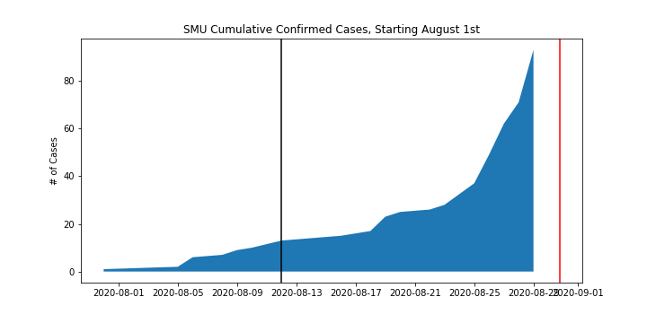
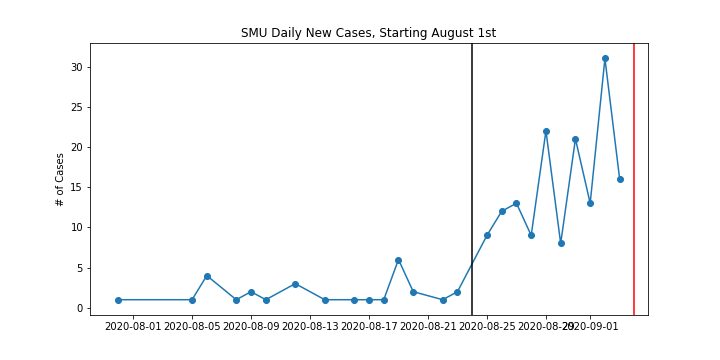
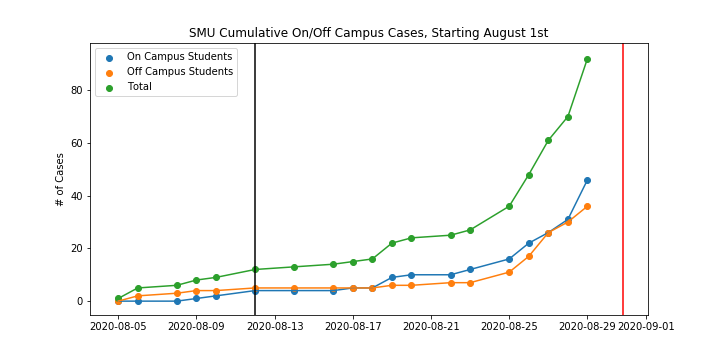
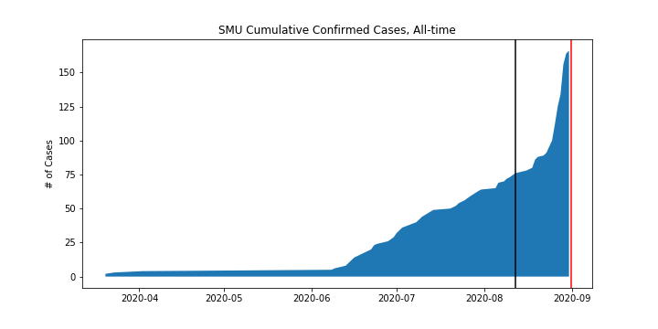
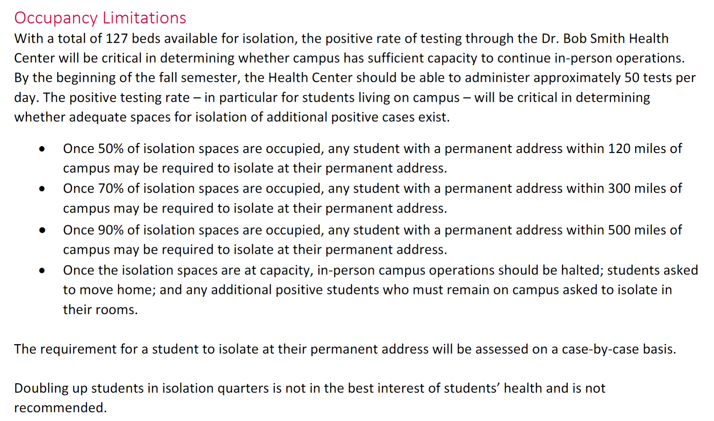

# Last Updated: 9/1/2020

### Total Active Cases: 105

Here are some plots of SMU's published COVID-19 case data. Solid black line indicates the first day of classes (August 24th), solid red line indicates the day these plots were last updated.

Below is an excerpt from SMU's [Fall 2020 Operations Plan](https://smu.app.box.com/s/rrp4y7vgndry6kb8xhrmtxdcbdftjs85).

This document was last updated on 8/21/2020. Assuming these figures still remain accurate, there are a total of <strong>**127**</strong> isolation beds.
<ul>
<li> **63** beds occupied means students with permanent addresses within 120 miles of campus may be sent home. </li>
<li> **88** beds occupied means students with permanent addresses within 300 miles of campus may be sent home. </li>
<li> **114** beds occupied means students with permanent addresses within 500 miles of campus may be sent home. </li>
<li> **127** beds occupied means in-person campus operations halted and remaining students asked to return home. </li>
</ul>

As of 9/1/2020, there are **58** active cases amongst students living in on-campus facilities. All off-campus students are expected to isolate off campus, so assuming all on-campus students are also isolating on-campus there are 58 isolation beds currently being utilized. This means that SMU is **5** on-campus cases away from hitting 63 beds occupied.
